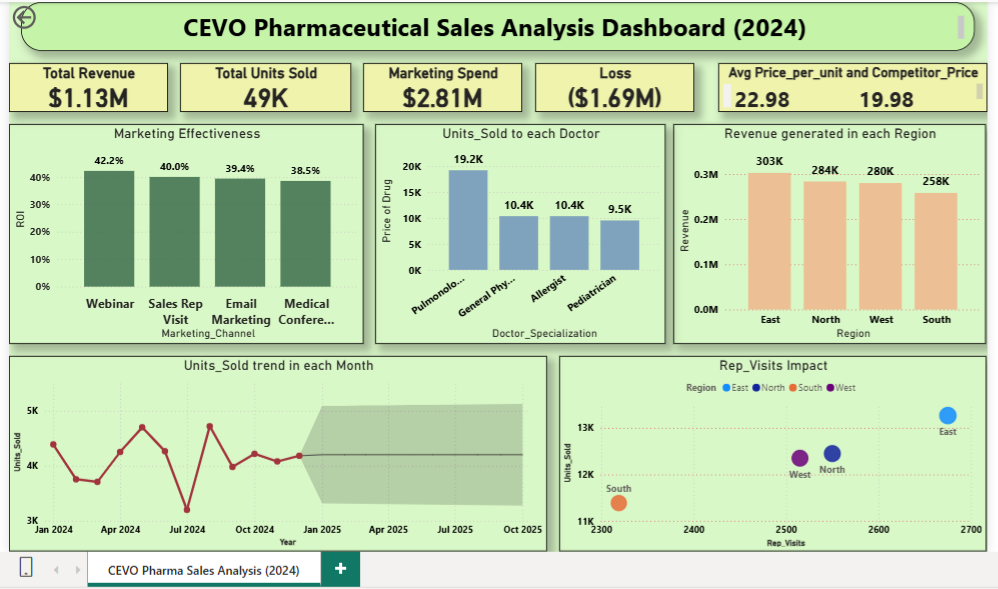

# CEVO-Pharmaceutical-Sales-Analysis-Case-Study
End-to-end pharmaceutical sales analysis of CEVO’s 2024 performance using Excel and Power BI to identify key gaps and recommend strategies for a successful 2026 relaunch.

## 🎯 Problem Statement
CEVO Pharma launched *BreatheEZ* in 2024 with the expectation of achieving strong market adoption. However, despite significant investment in marketing and sales efforts, the product failed to generate expected revenue and resulted in substantial financial losses.
The objective of this project is to analyze past sales data, identify key performance gaps, and provide data-driven recommendations to ensure a successful relaunch in 2026.

The company now aims to relaunch the drug in 2026 and requires insights into:
- Why the asthma drug underperformed in 2024?
- Which areas need improvement? 
- What strategies can drive better performance?

## 📂 Dataset Description
- The dataset used in this project is **fictional** and created for analytical purposes.
- It contains ~2500 rows of 2024 sales data including:
  - Date  
  - Region & City  
  - Hospital ID  
  - Doctor Specialization  
  - Marketing Channel  
  - Marketing Spend  
  - Price per Unit (CEVO vs Competitor)  
  - Units Sold  
  - Revenue  
  - Insurance Coverage
Extracted the Month and Month Name from Date column

## 🛠 Methodology
- Performed data cleaning and feature engineering in Excel, including deriving time-based features from the date column  
- Conducted exploratory data analysis (EDA) using pivot tables to identify trends across regions, doctors, and marketing channels  
- Built an interactive dashboard in Power BI to visualize sales performance, pricing, and marketing effectiveness  
- Developed a structured report and presentation to communicate insights and business recommendations

## 📊 Dashboard

## 📈 Key Insights
- 💰 Total Revenue: $1.13M vs Marketing Spend: $2.81M → Significant loss of $1.69M
- 💊 CEVO avg pricing ($22) was higher than competitors ($19), impacting adoption  
- 📊 Webinars and Sales Visits performed better than Medical Conferences  
- 👨‍⚕️ Pulmonologists contributed the highest share of prescriptions  
- 🌍 South region showed comparatively lower performance

## 🚀 Recommendations
- Optimize pricing strategy to align with competitors and improve adoption (~$20 on avg) 
- Reallocate marketing spend toward high-performing channels like webinars and sales visits  
- Focus on key doctor segments such as pulmonologists and allergists  
- Increase effectiveness of sales representative visits in high-potential areas  
- Strengthen partnerships with top-performing hospitals  
- Align marketing efforts with peak demand periods to maximize impact

## 🧰 Tools & Skills Used
- Microsoft Excel (Data Analysis, Pivot Tables, Power Query)
- Power BI (Dashboard & Visualization)

## 📁 Project Files
- **cevo_pharma_raw_data_2024.xlsx**- Raw dataset
- **Cleaned_CEVO_Pharma_Sales_Analysis.xlsx**- Excel analysis file (Pivot tables and EDA)
- **CEVO_Pharma_Sales_Dashboard.pbix**- PowerBI Dashboard
- **CEVO_Pharma_Sales_Report.pdf**- Report file
- **CEVO_Pharma_Sales_Analysis_PPT.pdf**- Presentation in pdf format
- **images/**- Dashboard photo which is used in README.md

